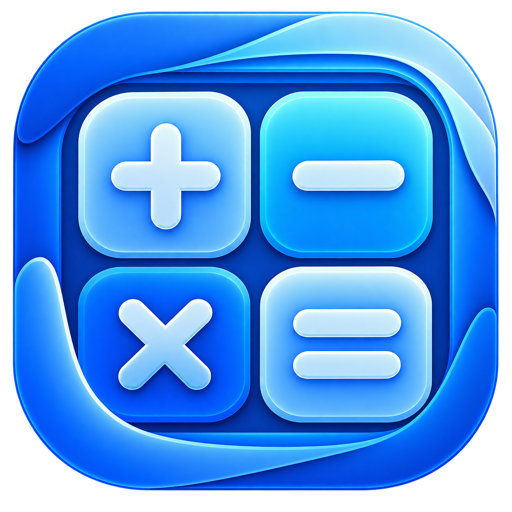
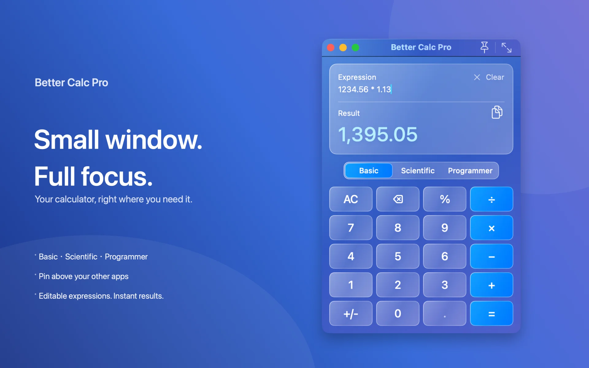
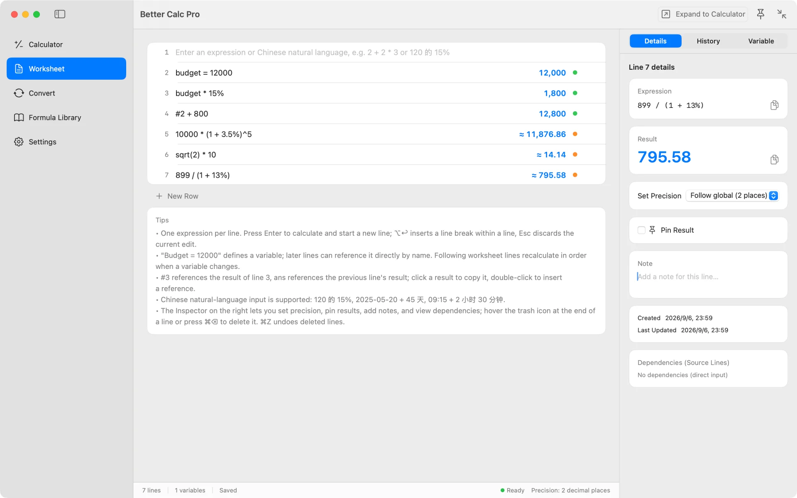
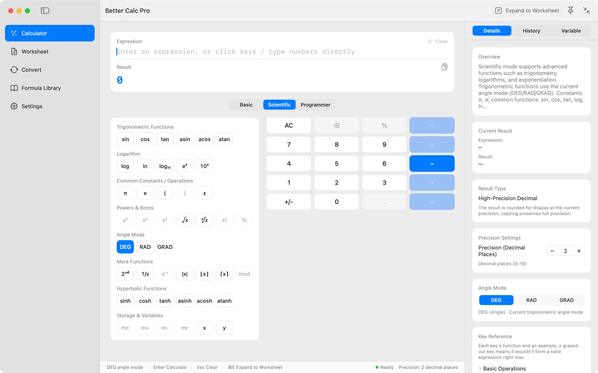
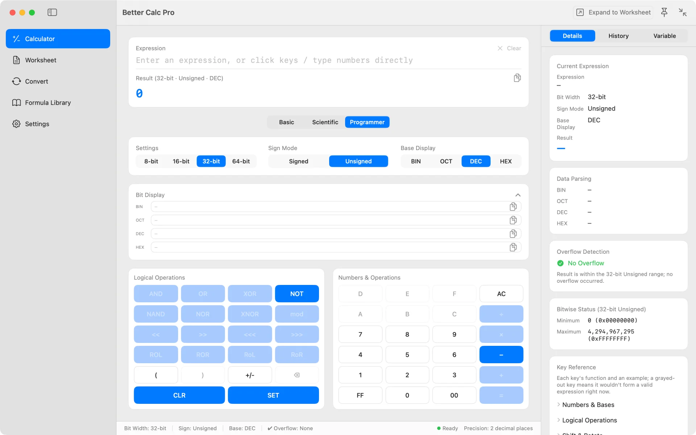
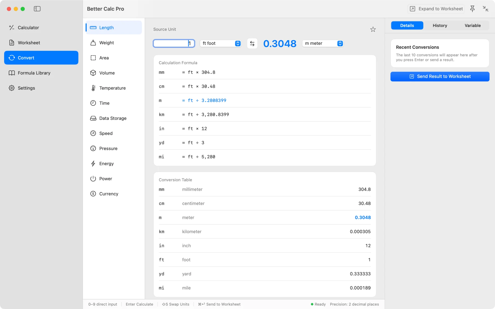
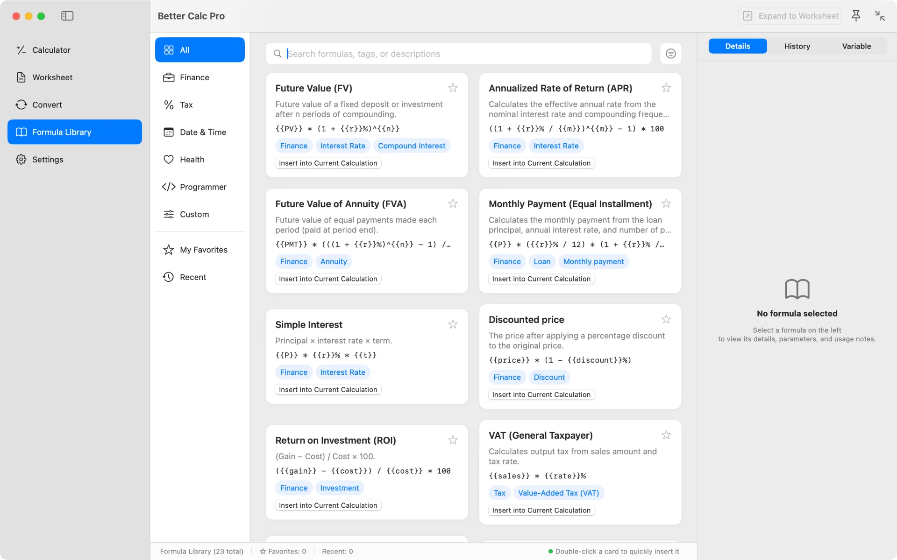
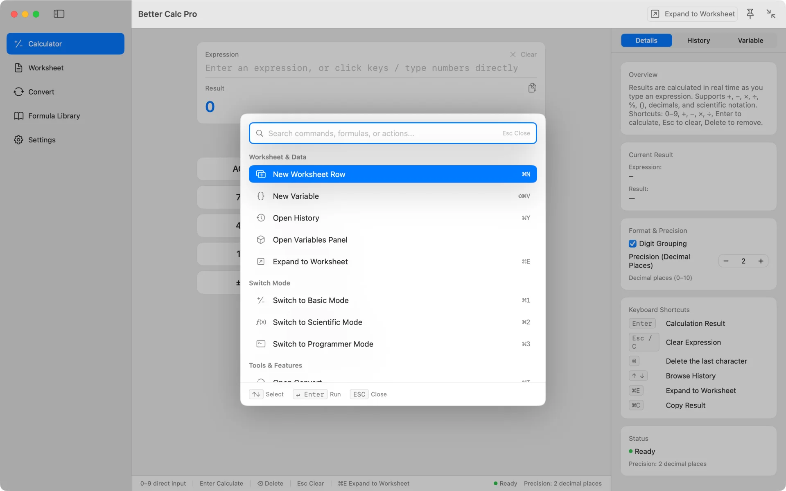
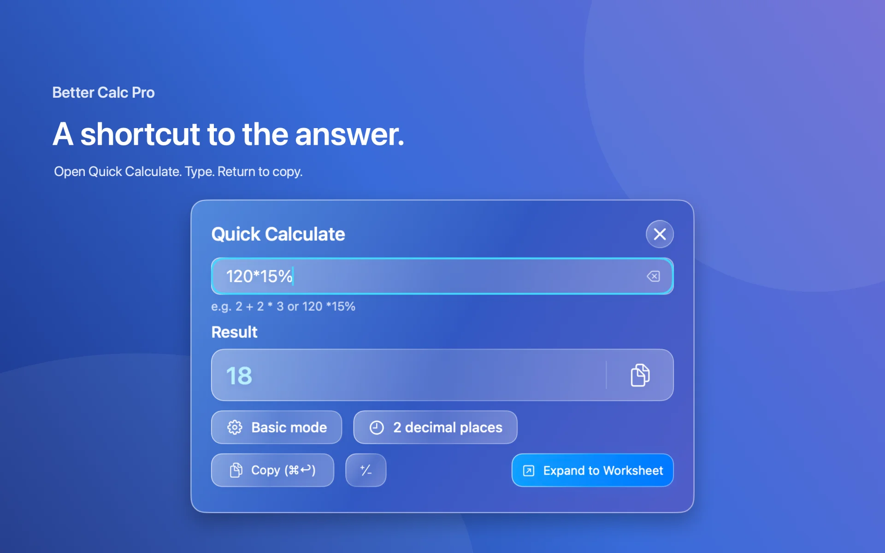
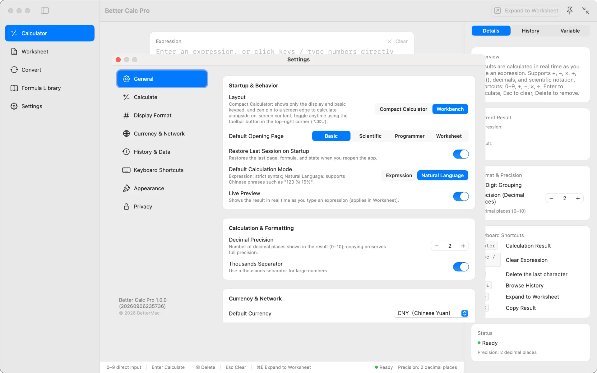

# Better Calc Pro

English · [简体中文](README.zh-CN.md)

A native macOS calculator that keeps the whole calculation on screen.

Better Calc Pro puts a line-by-line worksheet, basic, scientific, and programmer keypads, unit and currency conversion, and a formula library into one app — plus a compact calculator you can pin above your other windows. Free on the Mac App Store, with no in-app purchases.

## Download

<table>
  <tr>
    <td align="center" width="220">
       
      Scan to open in the App Store
    </td>
    <td>
      
      
<b>Free</b> · no in-app purchases · no subscription · no account

      
macOS 15 or later · Apple silicon and Intel

      
Using <a href="https://github.com/mas-cli/mas">mas</a>? <code>mas install 6808671381</code>

    </td>
  </tr>
</table>

## When to use Better Calc Pro

- Work through a budget, quote, or tax calculation where every step should stay visible and editable.
- Reuse earlier results by line number (`#3`) or by name (`budget = 12000`) and let later lines recalculate when an input changes.
- Do trigonometry, logs, roots, and angle-mode math, or BIN / OCT / DEC / HEX bit work with explicit width, sign, and overflow.
- Convert units offline, or currency with European Central Bank reference rates that show their source and update time.
- Get a quick answer from the menu bar or a global hotkey without leaving the app you are in.
- Type in Chinese: `120 的 15% 是多少`, `2026-08-27 + 45 天`.

## Highlights

- **Worksheet** — One expression per line with live results, `#N` line references, variables, and in-order recalculation. Pin, annotate, or delete lines; deletions can be undone.
- **Three keypads, one engine** — Basic, scientific (DEG / RAD / GRAD), and programmer (8/16/32/64-bit, signed and unsigned, bitwise ops, shifts and rotates, overflow shown).
- **Full-precision results** — Values are held as Decimal and only rounded for display. Copy the displayed value or the full-precision one.
- **Unit and currency conversion** — Length, weight, area, volume, temperature, time, data, speed, pressure, energy, power, and currency. Send any result to the worksheet.
- **Formula library** — 23 built-in formulas for finance, tax, date and time, health, and programming, plus your own.
- **Command palette** — `⌘K` reaches every page, action, and mode from the keyboard.
- **Quick Calculate** — Drops down from the menu bar or `⌥⌘K`: type, press Return, and the result is copied.
- **Compact and pinned** — Shrink to a display and keypad (`⌥⌘U`), pin it on top (`⌥⌘P`), and paste arithmetic from the clipboard while it floats.

## Screenshots

**Worksheet** — name a value, reference line `#2`, change one input and the lines after it recalculate

| | |
|---|---|
|  |  |
| **Scientific** — trigonometry, logs, powers and roots, with the angle mode always visible | **Programmer** — BIN, OCT, DEC, and HEX together, with bit width, sign, and overflow on screen |
|  |  |
| **Convert** — units convert offline; currency shows its source and update time | **Formula Library** — 23 built-in formulas plus your own; parameters expand into an editable expression |
|  |  |
| **Command Palette** — one search field over every page, action, and mode | **Quick Calculate** — type, press Return, and the result is copied as the panel closes |

**Settings** — precision, default page, natural-language mode, exchange-rate refresh, and hotkey recording

## Privacy

Better Calc Pro is local by default. There is no account, no analytics, no ads, and no tracking, and the App Store privacy label is **Data Not Collected**.

- Worksheets, history, variables, and formulas are stored in the app's sandbox container on your Mac.
- The only network request fetches exchange rates when you open currency conversion or refresh rates, and it carries only the base currency code.
- The clipboard is read only while the compact calculator is pinned on top, and only the arithmetic part of the copied text is used.
- The app requests no system permissions.

## Links

- [Mac App Store](https://apps.apple.com/app/id6808671381)
- [Product page](https://bettermac.net/en/products/better-calc/)
- [Support center](https://bettermac.net/en/support/?product=better-calc)
- [Contact us](https://bettermac.net/en/contact/?product=better-calc)
- [Privacy Policy](https://bettermac.net/en/privacy/)
- [Terms of Use](https://bettermac.net/en/terms/)
- [BetterMac website](https://bettermac.net/)

## Requirements

- macOS 15.0 (Sequoia) or later
- Universal — Apple silicon and Intel
- Interface languages: English and Simplified Chinese

## License

Better Calc Pro and the materials in this repository are proprietary and not open source. All rights reserved. No license is granted to copy, modify, distribute, or use them without prior written permission from BetterMacNet.
