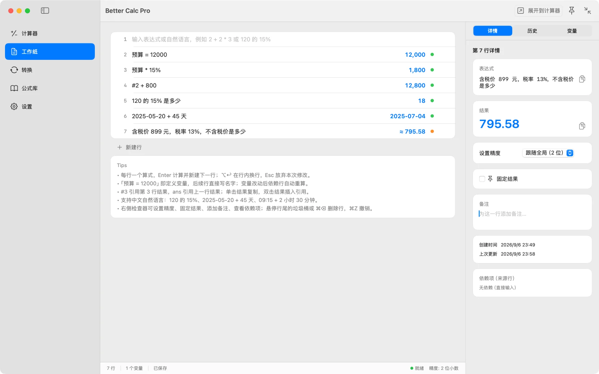
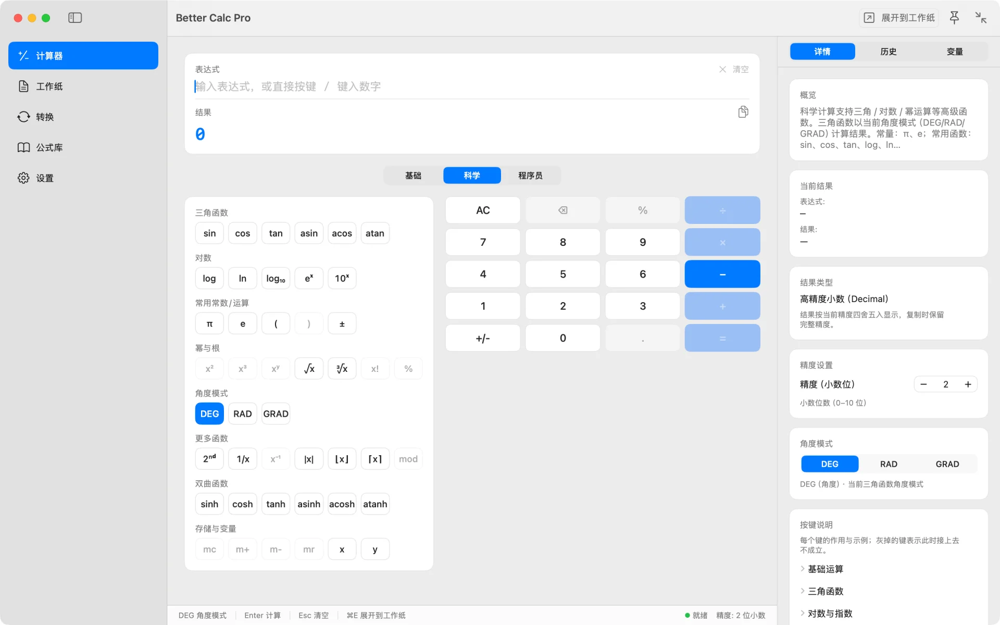
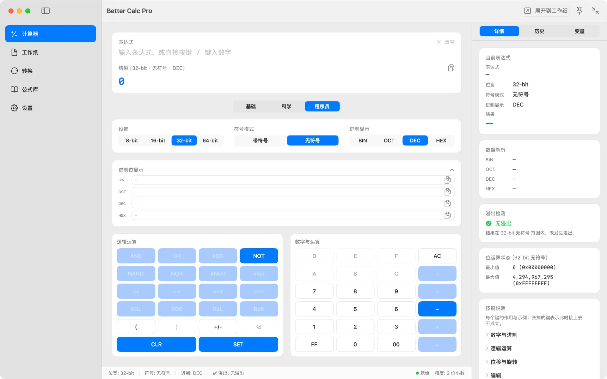
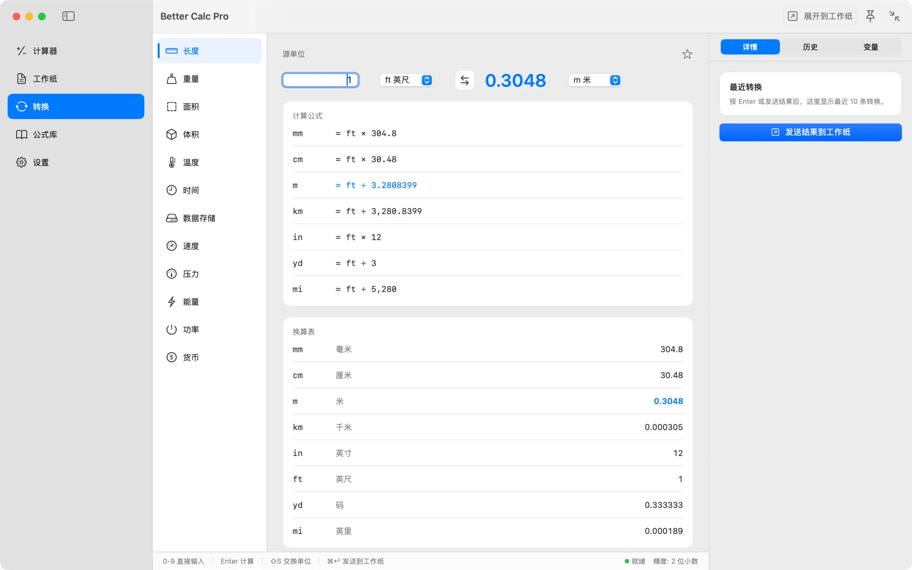
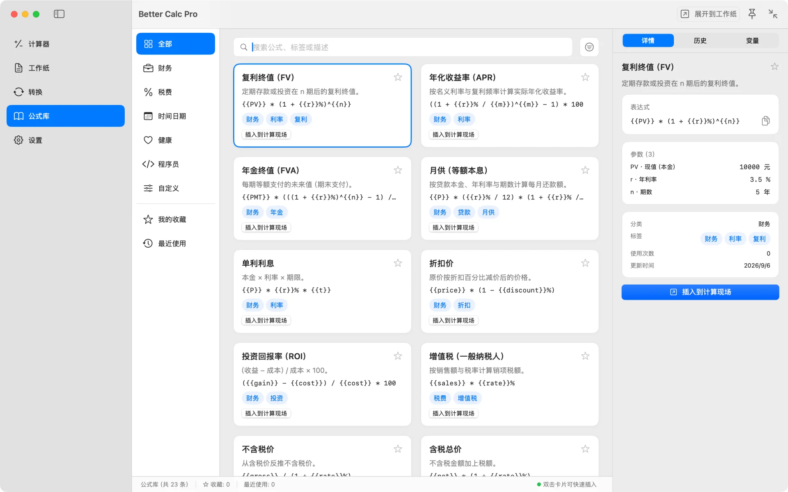
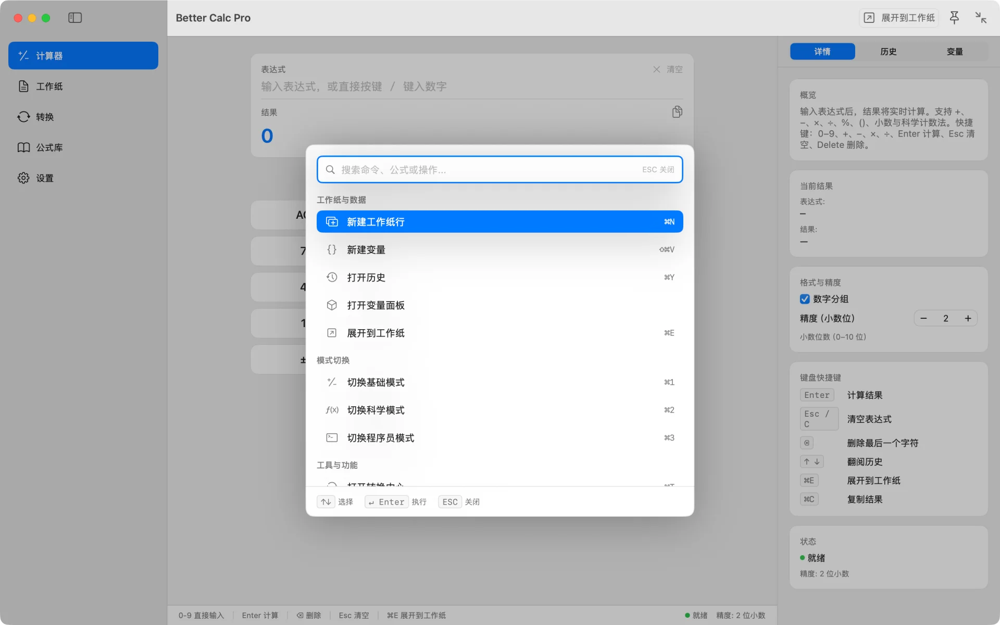
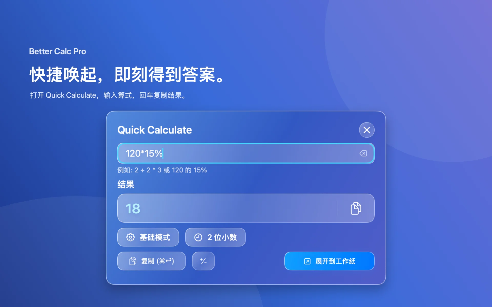

# Better Calc Pro

[English](README.md) · 简体中文

一款原生 macOS 计算器，把计算过程完整地留在屏幕上。

Better Calc Pro 把多行工作纸、基础 / 科学 / 程序员三套键盘、单位与汇率换算、公式库集中在一个应用里，还有一个可以置顶在其他窗口之上的紧凑计算器。在 Mac App Store 免费下载，没有应用内购买。

## 下载

<table>
  <tr>
    <td align="center" width="220">
       
      扫码在 App Store 中打开
    </td>
    <td>
      
      
<b>免费</b> · 无内购 · 无订阅 · 无需账号

      
macOS 15 或更高版本 · 支持 Apple 芯片与 Intel

      
使用 <a href="https://github.com/mas-cli/mas">mas</a>？<code>mas install 6808671381</code>

    </td>
  </tr>
</table>

## 什么时候使用 Better Calc Pro

- 算预算、报价、税费这类需要每一步都看得见、改得动的计算。
- 用行号（`#3`）或名字（`预算 = 12000`）复用前面的结果，改掉一个输入，后续行自动按顺序重算。
- 做三角函数、对数、幂与根等科学计算，或在明确的位宽、符号与溢出提示下做 BIN / OCT / DEC / HEX 位运算。
- 离线换算单位；按欧洲央行参考汇率换算货币，来源与更新时间都标在界面上。
- 不离开当前应用，从菜单栏或全局快捷键唤出，算完即走。
- 直接用中文问：`120 的 15% 是多少`、`2026-08-27 + 45 天`。

## 主要功能

- **工作纸** — 每行一个算式，结果实时显示；支持 `#N` 行引用、变量和按顺序重算。任意行可固定、加备注或删除，删除可撤销。
- **三套键盘，同一个引擎** — 基础、科学（DEG / RAD / GRAD）、程序员（8/16/32/64 位宽、有符号与无符号、位运算、移位与循环移位、溢出提示）。
- **全精度结果** — 内部以 Decimal 保存，只在显示时按精度格式化；可分别复制显示值与完整精度值。
- **单位与货币换算** — 长度、重量、面积、体积、温度、时间、数据存储、速度、压强、能量、功率与货币；结果可一键发送到工作纸。
- **公式库** — 财务、税费、时间日期、健康、程序员等分类内置 23 条公式，也可以自建。
- **命令面板** — `⌘K` 用键盘到达任何页面、操作与模式。
- **Quick Calculate** — 从菜单栏或 `⌥⌘K` 唤出：输入、回车，结果已复制。
- **紧凑与置顶** — 缩成显示卡加键盘（`⌥⌘U`），置顶在其他应用之上（`⌥⌘P`），置顶期间可接入剪贴板里的算式。

## 截图

**工作纸** — 给数值起名、用 `#2` 引用上一步，中文自然语言与日期加减直接算，改一处后续行重算

| | |
|---|---|
|  |  |
| **科学** — 三角函数、对数、幂与根，角度模式一眼可见 | **程序员** — 四进制同屏，位宽、符号与溢出状态始终写在界面上 |
|  |  |
| **转换** — 单位换算离线可用，汇率标明来源与更新时间 | **公式库** — 内置 23 条公式，也能自建；参数默认值展开为可编辑表达式 |
|  |  |
| **命令面板** — 一个搜索框到达任何页面、操作与模式 | **Quick Calculate** — 输入回车，结果复制后面板关闭 |

**设置** — 精度、默认页面、自然语言模式、汇率更新频率、快捷键录制

## 隐私

Better Calc Pro 默认只在本机工作：不用注册登录，没有统计、广告或跟踪，App Store 隐私标签为**未收集数据**。

- 工作纸、历史、变量和公式保存在本机的应用沙盒容器中。
- 唯一的网络请求是在打开货币换算或手动刷新时获取汇率，请求中只包含基准货币代码。
- 只有紧凑计算器处于置顶状态时才读取剪贴板，并且只取其中的算式部分。
- 应用不申请任何系统权限。

## 链接

- [Mac App Store](https://apps.apple.com/app/id6808671381)
- [产品页](https://bettermac.net/products/better-calc/)
- [支持中心](https://bettermac.net/support/?product=better-calc)
- [联系我们](https://bettermac.net/contact/?product=better-calc)
- [隐私政策](https://bettermac.net/privacy/)
- [服务条款](https://bettermac.net/terms/)
- [BetterMac 官网](https://bettermac.net/)

## 系统要求

- macOS 15.0（Sequoia）或更高版本
- 通用二进制，支持 Apple 芯片与 Intel
- 界面语言：简体中文与英文

## 许可

Better Calc Pro 及本仓库中的材料均为专有软件，并非开源。保留所有权利。未经 BetterMacNet 事先书面许可，不授予复制、修改、分发或使用的任何许可。
